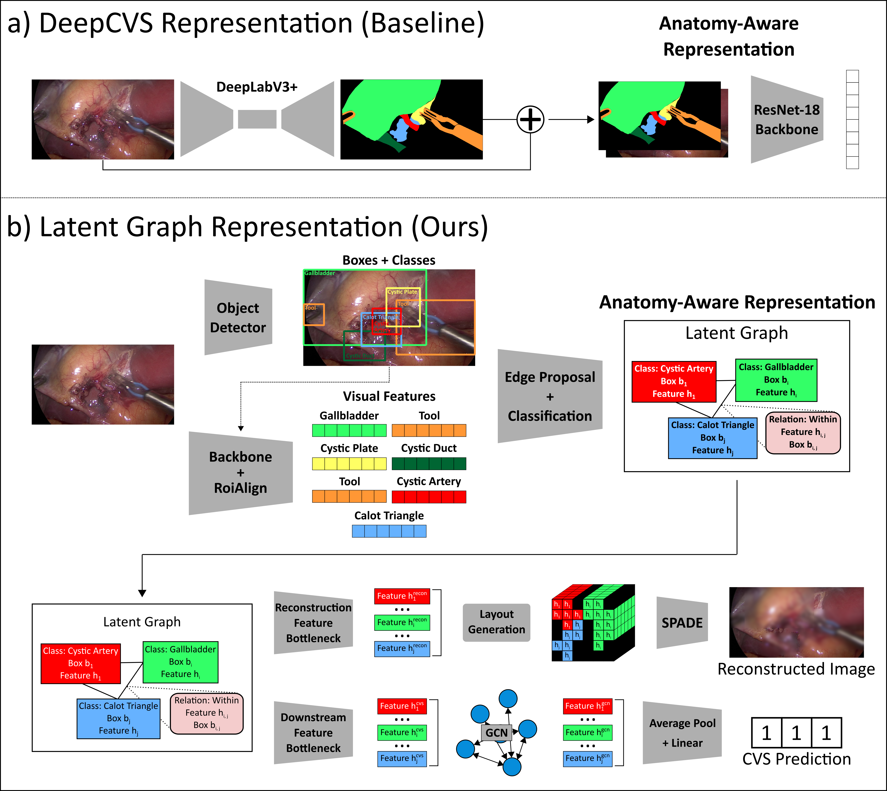
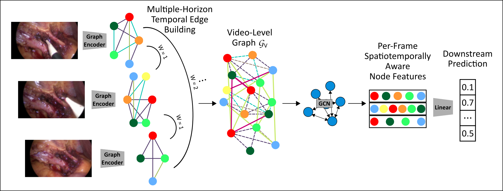

<div align="center">
<a href="http://camma.u-strasbg.fr/">

</a>
</div>

# **Latent Graph Representations for Surgical Scene Understanding**
This repository contains the code corresponding to our Transactions on Medical Imaging paper _Latent Graph Representations for Critical View of Safety Assessment_ and our MICCAI 2023 paper _Encoding Surgical Videos as Latent Spatiotemporal Graphs for Object- and Anatomy-Driven Reasoning_.

<div align="center">

</div>

[1] **Latent Graph Representations for Critical View of Safety Assessment**. _Aditya Murali, Deepak Alapatt, Pietro Mascagni, Armine Vardazaryan, Alain Garcia, Nariaki Okamoto, Didier Mutter, Nicolas Padoy. **IEEE Transactions on Medical Imaging 2023**_


[](https://arxiv.org/abs/2212.04155)
[](https://ieeexplore.ieee.org/document/10319763)

<div align="center">

</div>

[2] **Encoding Surgical Videos as Latent Spatiotemporal Graphs for Object and Anatomy-Driven Reasoning**. _Aditya Murali, Deepak Alapatt, Pietro Mascagni, Armine Vardazaryan, Alain Garcia, Nariaki Okamoto, Didier Mutter, Nicolas Padoy. **MICCAI 2023**_

[](https://arxiv.org/abs/2312.06829)
[](https://link.springer.com/chapter/10.1007/978-3-031-43996-4_62)

## News

#### In this repo we provide:
- Implementations of 3 different object detectors (Faster-RCNN, Cascade-RCNN, Deformable-DETR) and 3 different instance segmentation models (Mask-RCNN, Cascade-Mask-RCNN, Mask2Former) using the **_mmdetection_** framework.
- Implementations of 4 different object-centric models for CVS prediction introduced in [1]: LatentGraph-CVS (LG-CVS), DeepCVS, LayoutCVS, and ResNet50-DetInit, each of which can be run using any of the aforementioned object detection/segmentation models.
- Implementation of a simple classifier using **_mmengine + mmdetection_**.
- Implementations of 2 different spatiotemporal object-centric models introduced in [2]: **S**urgical **V**ideos as **L**atent **S**patio**T**emporal **G**raphs (SV2LSTG), and DeepCVS-Temporal (DC-Temp).
- Annotation files and instructions to setup 3 different datasets: Endoscapes, Cholec80 (with CholecSeg8k segmentation masks), and CholecT50
- Config files and instructions to train/evaluate object detectors/segmentation models on Endoscapes [3] and CholecSeg8k [4].
- Config files and instructions to train/evaluate the 5 single frame and 2 spatiotemporal methods on three tasks/datasets: CVS Prediction (Endoscapes), Phase Recognition (Cholec80), and Action Triplet Recognition (CholecT50)
- Trained model checkpoints for all tasks (coming soon).

# Get Started

## Installation
This project uses Pytorch 2.1.0 + CUDA 11.8, DGL 1.1.1, torch-scatter, mmdetection 3.2.0, and mmengine 0.7.4. Please note that you may encounter issues if you diverge from these versions. If you must diverge, please ensure that the DGL and torch-scatter versions match your versions of pytorch, and make sure to use mmengine<=0.7.4.

```sh
# clone mmdetection and export environment variable
> cd $HOME && git clone https://github.com/open-mmlab/mmdetection.git
> export MMDETECTION=$HOME/mmdetection

# clone SurgLatentGraph
> cd $HOME && git clone https://github.com/CAMMA-public/SurgLatentGraph.git
> cd SurgLatentGraph

# download pretrained weights
> cd weights
> wget -O coco_init_wts.zip https://seafile.unistra.fr/f/71eedc8ce9b44708ab01/?dl=1 && unzip coco_init_wts.zip && cd ..

# add surglatentgraph to PYTHONPATH to enable registry to find custom modules (note that this can be added to the .bashrc file for future use)
> export PYTHONPATH="$PYTHONPATH:$HOME/SurgLatentGraph"

# install dependencies 
> conda create -n latentgraph python=3.8 && conda activate latentgraph
(latentgraph) > conda install pytorch torchvision torchaudio pytorch-cuda=11.8 -c pytorch -c nvidia
(latentgraph) > conda install -c dglteam/label/cu113 dgl
(latentgraph) > pip install torch-scatter -f https://data.pyg.org/whl/torch-2.0.1+cu117.html
(latentgraph) > pip install -U openmim
(latentgraph) > mim install mmdet
(latentgraph) > mim install mmengine==0.7.4
(latentgraph) > pip install torchmetrics
(latentgraph) > pip install scikit-learn
(latentgraph) > pip install prettytable
(latentgraph) > pip install imagesize
(latentgraph) > pip install networkx
(latentgraph) > pip install opencv-python
(latentgraph) > pip install yapf==0.40.1
```

## Dataset Setup

Each dataset needs to be set up in the appropriate format. All of our models require frames to be extracted (at 1 fps) and use a modified COCO-style annotation structure. Each split of each dataset contains three JSON files:
- `annotation_coco.json` is used to train object detectors, and includes only frames which have bounding box/segmentation ground truth.
- `annotation_ds_coco.json` is used to train the single-frame downstream models, and includes all frames with labels for the downstream task.
- `annotation_coco_vid.json` is used to train the spatiotemporal downstream models, and includes all frames at 1 fps from each dataset, regardless of whether they contain downstream labels.

All three files follow the normal COCO format, with three additional image level tags:
- `is_det_keyframe` is a boolean value indicating whether the given frame contains ground-truth bounding box annotations.
- `is_ds_keyframe` is a boolean value indicating whether the given frame contains a ground-truth downstream annotation.
- `ds` contains the downstream annotation, which in our cases, can either be a list (CholecT50 triplet, Endoscapes CVS) for multilabel tasks or an integer (Cholec80 Phase) for single-frame tasks. In practice, for frames where `is_ds_keyframe` is `False`, we include the label from the last labeled frame in the video (ensures causality).

### Dataset/Annotation Downloads
[](https://github.com/CAMMA-public/Endoscapes)
[](https://github.com/CAMMA-public/cholect50)
[](https://s3.unistra.fr/camma_public/datasets/COCO-Style_Annots/cholecT50.zip)
[](https://docs.google.com/forms/d/1GwZFM3-GhEduBs1d5QzbfFksKmS1OqXZAz8keYi-wKI)
[](https://s3.unistra.fr/camma_public/datasets/COCO-Style_Annots/cholec80.zip)

The Cholec80 and CholecT50 dataset download links contain entire surgical videos. To use them with this repository, the frames need to be extracted and named in the correct format, and our modified COCO-style annotations need to be downloaded. To guide this process, we provide example dataset folders with symbolic links in place of images, re-organized metadata for each dataset (`all_metadata.csv`), and the JSON-style annotations using the COCO Style Annotations link.

**Example Setup**
```shell
mkdir -p data/mmdet_datasets/
cd data/mmdet_datasets

# TODO: Download the annotations for each dataset using the COCO-style Annotations link.
unzip cholec80.zip && rm cholec80.zip
cd cholec80 && mkdir frames
# TODO: Extract frames at 25 fps and organize into the following directory structure
# - frames
#   - video01
#       - 0.jpg
#       - 1.jpg
#       ...
#   ...

# create symlinks
python copy_images.py

unzip cholecT50.zip && rm cholecT50.zip
cd cholecT50 && mkdir frames
# TODO: Extract frames at 25 fps and organize into the following directory structure
# - frames
#   - video01
#       - 0.jpg
#       - 1.jpg
#       ...
#   ...

# create symlinks
python copy_images.py

# For Endoscapes, the dataset is released in the same format we use in this repository, so you can just extract the files directly.
unzip endoscapes.zip && rm endoscapes.zip
```

The final directory structure should be as follows, with all symbolic links pointing to downloaded/extracted frames.
```shell
data/mmdet_datasets
└── endoscapes/
    └── train/
        └── 1_14050.jpg
        ...
        └── 120_40750.jpg
        └── annotation_coco.json
        └── annotation_ds_coco.json
        └── annotation_coco_vid.json
    └── val/
        └── 121_23575.jpg
        ...
        └── 161_39400.jpg
        └── annotation_coco.json
        └── annotation_ds_coco.json
        └── annotation_coco_vid.json
    └── test/
        └── 162_1225.jpg
        ...
        └── 201_55250.jpg
        └── annotation_coco.json
        └── annotation_ds_coco.json
        └── annotation_coco_vid.json
    └── train_seg/
        └── 100_27200.jpg
        ...
        └── 98_65650.jpg
        └── annotation_coco.json
    └── val_seg/
        └── 126_11550.jpg
        ...
        └── 159_60800.jpg
        └── annotation_coco.json
    └── test_seg/
        └── 165_23650.jpg
        ...
        └── 189_34800.jpg
        └── annotation_coco.json
    └── train_vids.txt
    └── val_vids.txt
    └── test_vids.txt
    └── train_seg_vids.txt
    └── val_seg_vids.txt
    └── test_seg_vids.txt
└── cholec80/
    └── train_phase/
        └── 1_0.jpg
        └── 1_25.jpg
        └── 1_50.jpg
        ...
        └── 30_0.jpg
        ...
        └── 40_55525.jpg
        └── annotation_coco.json
        └── annotation_ds_coco.json
        └── annotation_coco_vid.json
    └── val_phase/
        └── 41_0.jpg
        ...
        └── 48_45825.jpg
        └── annotation_coco.json
        └── annotation_ds_coco.json
        └── annotation_coco_vid.json
    └── test_phase/
        └── 49_0.jpg
        ...
        └── 80_43075.jpg
        └── annotation_coco.json
        └── annotation_ds_coco.json
        └── annotation_coco_vid.json
    └── train_vids.txt
    └── val_vids.txt
    └── test_vids.txt
└── cholecT50/
    └── train/
        └── 1_0.jpg
        ...
        └── 42_92775.jpg
        └── annotation_coco.json
        └── annotation_ds_coco.json
        └── annotation_coco_vid.json
    └── val/
        └── 5_0.jpg
        ...
        └── 74_40825.jpg
        └── annotation_coco.json
        └── annotation_ds_coco.json
        └── annotation_coco_vid.json
    └── test/
        └── 92_0.jpg
        ...
        └── 111_53625.jpg
        └── annotation_coco.json
        └── annotation_ds_coco.json
        └── annotation_coco_vid.json
```

## Config Structure
Each `dataset | detector | downstream_method` combination has its own configuration. We summarize the config structure below.
```shell
configs/
└── models/
    └── endoscapes/
        └── lg_base_box.py
        └── lg_base_seg.py
        └── lg_ds_base.py
        └── lg_save_base.py
        └── deepcvs_base.py
        └── simple_classifier.py
        └── simple_classifier_with_recon.py
        └── ssl
            └── simple_classifier_${INIT}.py
            ... # ResNet50 with different backbone initializations
    └── c80_phase/
        └── lg_base_box.py
        ... # same files as endoscapes
    └── cholecT50/
        └── lg_base_box.py
        ... # same files as endoscapes
    └── ${DETECTOR}/ # e.g. faster_rcnn
        └── lg_${DETECTOR}.py
        └── lg_ds_${DETECTOR}.py
        └── lg_ds_${DETECTOR}_no_recon.py
        └── lg_save_${DETECTOR}.py
        └── lg_ft_save_${DETECTOR}.py
        └── layout_${DETECTOR}.py
        └── layout_${DETECTOR}_no_recon.py
        └── dc_${DETECTOR}.py
        └── dc_${DETECTOR}_no_recon.py
        ... # some ablations
    ... # one folder for each detector
    └── select_dataset.sh
└── temporal_models/
    └── endoscapes/
        └── sv2lstg_model_base.py
        └── sv2lstg_5_base.py # sv2lstg
        └── sv2lstg_10_base.py
        └── sv2lstg_15_base.py
        └── sv2lstg_load_graphs_5_base.py # sv2lstg, skip image -> graph encoding and load saved graph
        └── sv2lstg_load_graphs_10_base.py
        └── sv2lstg_load_graphs_15_base.py
        └── dc_temp_model_base.py
        └── dc_temp_5_base.py # deepcvs-temporal
        └── dc_temp_10_base.py
        └── dc_temp_15_base.py
    └── cholecT50/
        └── ... # same as endoscapes
    └── c80_phase/
        └── ... # same as endoscapes
        └── sv2lstg_load_graphs_all.py # load all graphs in video -> temporal decoding to predict phase
    └── ${DETECTOR}/ # e.g. faster_rcnn
        └── sv2lstg_${DETECTOR}_5.py # use ${DETECTOR} to construct each latent graph, clips of 5 frames
        └── sv2lstg_${DETECTOR}_10.py
        └── sv2lstg_${DETECTOR}_15.py
        └── sv2lstg_lin_probe_${DETECTOR}_5.py # load latent graphs constructed with ${DETECTOR}, linear probing with clips of 5 frames
        └── sv2lstg_lin_probe_${DETECTOR}_10.py
        └── sv2lstg_lin_probe_${DETECTOR}_15.py
    ... # one folder for each detector
    └── select_dataset.sh
└── datasets/
    └── endoscapes/
        └── endoscapes_instance.py # dataset cfg to load a frame and any associated annotations
        └── endoscapes_vid_instance.py # dataset cfg to load a clip and any associated annotations
        └── endoscapes_vid_instance_load_graphs.py # dataset cfg to load a clip, precomputed latent graphs for each frame, and any associated annotations
    ... # same structure for each dataset
```

## Models
```shell
└── model
    └── lg.py # LG-CVS
    └── deepcvs.py # DeepCVS
    └── simple_classifier.py # R50 & R50-DetInit
    └── sv2lstg.py # SV2LSTG
    └── deepcvs_temporal.py # DC-Temporal
    └── predictor_heads
        └── graph.py # graph head in LG-CVS
        └── reconstruction.py # reconstruction head for all
        └── ds.py # downstream classification head in LG-CVS
        ... # additional model components
    ... # additional model components
```

## Training and Testing
We provide instructions to train each of model on dataset `${DATASET}` using underlying object detector `${DETECTOR}` and clips of length `${CLIP_SIZE}`.

### Select Dataset
Before training any object detector/downstream classification model, the dataset needs to be selected.
```shell
cd configs/models
./select_dataset.sh ${DATASET}
cd ../..
```

### Object Detector

To train the downstream models (with the exception of the simple classifier), an object detector must first be trained.
We provide example commands for training and testing diffent object detectors below.

**Train**
```shell
mim train mmdet configs/models/${DETECTOR}/lg_${DETECTOR}.py
```

**Test**
```shell
mim test mmdet configs/models/${DETECTOR}/lg_${DETECTOR}.py --checkpoint work_dirs/lg_${DETECTOR}/best_${DATASET}_{bbox/segm}_mAP_epoch_${BEST_VAL_EPOCH}.pth
```

The downstream classification models expect the trained detector weights to be in the directory `weights/${DATASET}`, so we need to copy the weights there.
```shell
mkdir -p weights/${DATASET}/
cp work_dirs/lg_${DETECTOR}/best_${DATASET}_{bbox/segm}_mAP_epoch_${BEST_VAL_EPOCH}.pth weights/${DATASET}/lg_${DETECTOR}.pth
```

Finally, we will extract and save just the backbone weights from the trained object detector, which will be useful for later experiments.
```shell
python weights/extract_bb_weights.py weights/${DATASET}/lg_${DETECTOR}.pth
```

### Single-Frame Models

Here, we provide example commands for training/testing each of the single-frame downstream classification methods (LG-CVS, DeepCVS, LayoutCVS, ResNet50-DetInit, ResNet50).

**LG**
```shell
mim train mmdet configs/models/${DETECTOR}/lg_ds_${DETECTOR}.py
mim test mmdet configs/models/${DETECTOR}/lg_ds_${DETECTOR}.py --checkpoint work_dirs/lg_ds_${DETECTOR}/best_${DATASET}_ds_${SELECTION_METRIC}_epoch_${EPOCH}.pth
```
OR 
```shell
# no reconstruction objective
mim train mmdet configs/models/${DETECTOR}/lg_ds_${DETECTOR}_no_recon.py
mim test mmdet configs/models/${DETECTOR}/lg_ds_${DETECTOR}_no_recon.py --checkpoint work_dirs/lg_ds_${DETECTOR}_no_recon/best_${DATASET}_ds_${SELECTION_METRIC}_epoch_${EPOCH}.pth
```

**DeepCVS**
```shell
mim train mmdet configs/models/${DETECTOR}/dc_${DETECTOR}.py
mim test mmdet configs/models/${DETECTOR}/dc_${DETECTOR}.py --checkpoint work_dirs/dc_${DETECTOR}/best_${DATASET}_ds_${SELECTION_METRIC}_epoch_${EPOCH}.pth
```
OR 
```shell
# no reconstruction objective
mim train mmdet configs/models/${DETECTOR}/dc_${DETECTOR}_no_recon.py
mim test mmdet configs/models/${DETECTOR}/dc_${DETECTOR}_no_recon.py --checkpoint work_dirs/dc_${DETECTOR}_no_recon/best_${DATASET}_ds_${SELECTION_METRIC}_epoch_${EPOCH}.pth
```

**LayoutCVS**
```shell
mim train mmdet configs/models/${DETECTOR}/layout_${DETECTOR}.py
mim test mmdet configs/models/${DETECTOR}/layout_${DETECTOR}.py --checkpoint work_dirs/layout_${DETECTOR}/best_${DATASET}_ds_${SELECTION_METRIC}_epoch_${EPOCH}.pth
```
OR
```shell
# no reconstruction objective
mim train mmdet configs/models/${DETECTOR}/layout_${DETECTOR}_no_recon.py
mim test mmdet configs/models/${DETECTOR}/layout_${DETECTOR}_no_recon.py --checkpoint work_dirs/layout_${DETECTOR}_no_recon/best_${DATASET}_ds_${SELECTION_METRIC}_epoch_${EPOCH}.pth
```

**ResNet50-DetInit**
```shell
mim train mmdet configs/models/simple_classifier_with_recon.py --cfg-options load_from=weights/${DATASET}/lg_{$DETECTOR}_bb.pth --work-dir work_dirs/R50_DI_${DETECTOR}
mim test mmdet configs/models/simple_classifier_with_recon.py --checkpoint work_dirs/R50_DI_${DETECTOR}/best_${DATASET}_ds_${SELECTION_METRIC}_epoch_${EPOCH}.pth
```
OR 
```shell
# no reconstruction objective
mim train mmdet configs/models/simple_classifier.py --cfg-options load_from=weights/${DATASET}/lg_{$DETECTOR}_bb.pth --work-dir work_dirs/R50_DI_${DETECTOR}_no_recon
mim test mmdet configs/models/simple_classifier.py --checkpoint work_dirs/R50_DI_${DETECTOR}_no_recon/best_${DATASET}_ds_${SELECTION_METRIC}_epoch_${EPOCH}.pth
```

**ResNet50**
```shell
mim train mmdet configs/models/simple_classifier.py
mim test mmdet configs/models/simple_classifier.py --checkpoint work_dirs/simple_classifier/best_${DATASET}_ds_${SELECTION_METRIC}_epoch_${EPOCH}.pth
```
OR 
```shell
# WITH reconstruction objective
mim train mmdet configs/models/simple_classifier_with_recon.py
mim test mmdet configs/models/simple_classifier_with_recon.py --checkpoint work_dirs/simple_classifier_with_recon/best_${DATASET}_ds_${SELECTION_METRIC}_epoch_${EPOCH}.pth
```

### Temporal Models
Here, we provide example commands for training/testing each of the spatiotemporal downstream classification methods (SV2LSTG, DC-Temporal). Note that we do not use a reconstruction objective for these methods.

**Encoding *S*urgical *V*ideos as *L*atent *S*patio*T*emporal *G*raphs (SV2LSTG)**
```shell
mim train mmdet configs/models/${DETECTOR}/sv2lstg_${DETECTOR}_${CLIP_SIZE}.py
mim test mmdet configs/models/${DETECTOR}/sv2lstg_${DETECTOR}_${CLIP_SIZE}.py --checkpoint work_dirs/sv2lstg_${DETECTOR}_${CLIP_SIZE}/best_${DATASET}_ds_${SELECTION_METRIC}_iter_${ITERATION}.pth
```
OR
```shell
# Linear Probing (No Finetuning Backbone)
mim train mmdet configs/models/${DETECTOR}/sv2lstg_lin_probe_${DETECTOR}_${CLIP_SIZE}.py
mim test mmdet configs/models/${DETECTOR}/sv2lstg_lin_probe_${DETECTOR}_${CLIP_SIZE}.py --checkpoint work_dirs/sv2lstg_lin_probe_${DETECTOR}_${CLIP_SIZE}/best_${DATASET}_ds_${SELECTION_METRIC}_epoch_${EPOCH}.pth
```

**DeepCVS-Temporal (DC-Temp)**
```shell
mim train mmdet configs/models/${DETECTOR}/dc_temp_${DETECTOR}_${CLIP_SIZE}.py
mim test mmdet configs/models/${DETECTOR}/dc_temp_${DETECTOR}_${CLIP_SIZE}.py --checkpoint work_dirs/dc_temp_${DETECTOR}_${CLIP_SIZE}/best_${DATASET}_ds_${SELECTION_METRIC}_epoch_${EPOCH}.pth
```

## Reproducing Results from Papers
Here, we provide the training commands to reproduce the main results from each of our works [1, 2]. The commands follow the same format as above, we simply include them for clarity.

**LG-CVS** [1]
```shell
cd configs/models
./select_dataset.sh endoscapes
cd ../..

# first train detectors (Faster-RCNN and Mask-RCNN)
mim train mmdet configs/models/faster_rcnn/lg_faster_rcnn.py
mim test mmdet configs/models/faster_rcnn/lg_faster_rcnn.py --checkpoint work_dirs/lg_faster_rcnn/best_endoscapes_bbox_mAP_epoch_${EPOCH}.pth

mim train mmdet configs/models/mask_rcnn/lg_mask_rcnn.py
mim test mmdet configs/models/mask_rcnn/lg_mask_rcnn.py --checkpoint work_dirs/lg_mask_rcnn/best_endoscapes_segm_mAP_epoch_${EPOCH}.pth

# copy weights
mkdir -p weights/endoscapes/
cp work_dirs/lg_faster_rcnn/best_endoscapes_bbox_mAP_epoch_${EPOCH}.pth weights/endoscapes/lg_faster_rcnn.pth
cp work_dirs/lg_mask_rcnn/best_endoscapes_segm_mAP_epoch_${EPOCH}.pth weights/endoscapes/lg_mask_rcnn.pth

# train downstream
mim train mmdet configs/models/faster_rcnn/lg_ds_faster_rcnn.py # CVS with Box (Best Model Uses Reconstruction)
mim test mmdet configs/models/faster_rcnn/lg_ds_faster_rcnn.py --checkpoint work_dirs/lg_ds_faster_rcnn/best_endoscapes_ds_average_precision_epoch_${EPOCH}.pth

mim train mmdet configs/models/mask_rcnn/lg_ds_mask_rcnn_no_recon.py # CVS with Mask (Best Model does not use Reconstruction)
mim test mmdet configs/models/mask_rcnn/lg_ds_mask_rcnn_no_recon.py --checkpoint work_dirs/lg_ds_mask_rcnn_no_recon/best_endoscapes_ds_average_precision_epoch_${EPOCH}.pth
```

**SV2LSTG** [2]

CVS Prediction
```shell
# select dataset
cd configs/temporal_models/
./select_dataset.sh endoscapes
cd ../..

# train detectors (can skip if already done for another model)
mim train mmdet configs/models/faster_rcnn/lg_faster_rcnn.py
mim test mmdet configs/models/faster_rcnn/lg_faster_rcnn.py --checkpoint work_dirs/lg_faster_rcnn/best_endoscapes_bbox_mAP_epoch_${EPOCH}.pth

mim train mmdet configs/models/mask_rcnn/lg_mask_rcnn.py
mim test mmdet configs/models/mask_rcnn/lg_mask_rcnn.py --checkpoint work_dirs/lg_mask_rcnn/best_endoscapes_segm_mAP_epoch_${EPOCH}.pth

# copy weights
mkdir -p weights/endoscapes/
cp work_dirs/lg_faster_rcnn/best_endoscapes_bbox_mAP_epoch_${EPOCH}.pth weights/endoscapes/lg_faster_rcnn.pth
cp work_dirs/lg_mask_rcnn/best_endoscapes_segm_mAP_epoch_${EPOCH}.pth weights/endoscapes/lg_mask_rcnn.pth

# train downstream
mim train mmdet configs/temporal_models/faster_rcnn/sv2lstg_faster_rcnn_10.py # CVS Box
mim test mmdet configs/temporal_models/faster_rcnn/sv2lstg_faster_rcnn_10.py --checkpoint work_dirs/sv2lstg_faster_rcnn_10/best_endoscapes_ds_average_precision_epoch_${EPOCH}.pth

mim train mmdet configs/temporal_models/mask_rcnn/sv2lstg_mask_rcnn_10.py # CVS Seg
mim test mmdet configs/temporal_models/mask_rcnn/sv2lstg_mask_rcnn_10.py --checkpoint work_dirs/sv2lstg_mask_rcnn_10/best_endoscapes_ds_average_precision_epoch_${EPOCH}.pth
```

Phase Recognition
```shell
cd configs/temporal_models
./select_dataset.sh c80_phase
cd ../..

# train object detectors
mim train mmdet configs/models/faster_rcnn/lg_faster_rcnn.py
mim test mmdet configs/models/faster_rcnn/lg_faster_rcnn.py --checkpoint work_dirs/lg_faster_rcnn/best_c80_phase_bbox_mAP_epoch_${EPOCH}.pth

mim train mmdet configs/models/mask_rcnn/lg_mask_rcnn.py
mim test mmdet configs/models/mask_rcnn/lg_mask_rcnn.py --checkpoint work_dirs/lg_mask_rcnn/best_c80_phase_segm_mAP_epoch_${EPOCH}.pth

# copy weights
mkdir -p weights/c80_phase/
cp work_dirs/lg_faster_rcnn/best_c80_phase_bbox_mAP_epoch_${EPOCH}.pth weights/c80_phase/lg_faster_rcnn.pth
cp work_dirs/lg_mask_rcnn/best_c80_phase_segm_mAP_epoch_${EPOCH}.pth weights/c80_phase/lg_mask_rcnn.pth

# Phase Recognition (Linear Probing / No Finetuning)
mim test mmdet configs/models/faster_rcnn/lg_save_faster_rcnn.py --checkpoint weights/c80_phase/lg_faster_rcnn.pth # first save single-frame latent graphs
mim train mmdet configs/temporal_models/faster_rcnn/sv2lstg_lin_probe_faster_rcnn_all.py
mim test mmdet configs/temporal_models/faster_rcnn/sv2lstg_lin_probe_faster_rcnn_all.py --checkpoint work_dirs/sv2lstg_lin_probe_faster_rcnn_all/best_c80_phase_ds_video_f1_epoch_${EPOCH}.pth

mim test mmdet configs/models/mask_rcnn/lg_save_mask_rcnn.py --checkpoint weights/c80_phase/lg_mask_rcnn.pth # first save single-frame latent graphs
mim train mmdet configs/temporal_models/mask_rcnn/sv2lstg_lin_probe_mask_rcnn_all.py
mim test mmdet configs/temporal_models/mask_rcnn/sv2lstg_lin_probe_mask_rcnn_all.py --checkpoint work_dirs/sv2lstg_lin_probe_mask_rcnn_all/best_c80_phase_ds_video_f1_epoch_${EPOCH}.pth

# Phase Recognition (With Single-Frame Finetuning)
mim train mmdet configs/models/faster_rcnn/lg_ds_faster_rcnn.py
cp work_dirs/lg_ds_faster_rcnn/best_c80_phase_ds_video_f1_epoch_${EPOCH}.pth weights/c80_phase/lg_ds_faster_rcnn.pth
mim test mmdet configs/models/faster_rcnn/lg_ft_save_faster_rcnn.py --checkpoint weights/c80_phase/lg_ds_faster_rcnn.pth
mim train mmdet configs/temporal_models/faster_rcnn/sv2lstg_lin_probe_faster_rcnn_all.py
mim test mmdet configs/temporal_models/faster_rcnn/sv2lstg_lin_probe_faster_rcnn_all.py --checkpoint work_dirs/sv2lstg_lin_probe_faster_rcnn_all/best_c80_phase_ds_video_f1_epoch_${EPOCH}.pth

mim train mmdet configs/models/mask_rcnn/lg_ds_mask_rcnn_no_recon.py
cp work_dirs/lg_ds_mask_rcnn_no_recon/best_c80_phase_ds_video_f1_epoch_${EPOCH}.pth weights/c80_phase/lg_ds_mask_rcnn_no_recon.pth
mim test mmdet configs/models/mask_rcnn/lg_ft_save_mask_rcnn.py --checkpoint weights/c80_phase/lg_ds_mask_rcnn_no_recon.pth # first save single-frame latent graphs
mim train mmdet configs/temporal_models/mask_rcnn/sv2lstg_lin_probe_mask_rcnn_all.py
mim test mmdet configs/temporal_models/mask_rcnn/sv2lstg_lin_probe_mask_rcnn_all.py --checkpoint work_dirs/sv2lstg_lin_probe_mask_rcnn_all/best_c80_phase_ds_video_f1_epoch_${EPOCH}.pth
```

**Note**: When training/testing object detectors on the dataset `c80_phase`, this corresponds to using the 8080 frames and segmentation masks introduced in CholecSeg8k [3], with the train/val/test sets comprising frames belonging to videos from the Cholec80 train/val/test sets (5360 train, 720 val, and 2000 test). For CholecT50, we simply use the same detector, as none of the CholecSeg8k frames correspond to the CholecT50 test set, making evaluation impossible. As a result, we do not provide the `annotation_coco.json` file for CholecT50.

## Pretrained Model Weights

Coming Soon!

## License
The code, models, and datasets released here are available for non-commercial scientific research purposes as defined in the [CC BY-NC-SA 4.0](https://creativecommons.org/licenses/by-nc-sa/4.0/). By downloading and using this code you agree to the terms in the [LICENSE](LICENSE). Third-party codes are subject to their respective licenses.

## Acknowledgement
This work was supported by French state funds managed by the ANR within the National AI Chair program under Grant ANR-20-CHIA-
0029-01 (Chair AI4ORSafety) and within the Investments for the future program under Grants ANR-10-IDEX-0002-02 (IdEx Unistra) and ANR-
10-IAHU-02 (IHU Strasbourg). This work was granted access to the HPC resources of IDRIS under the allocation 2021-AD011011640R1
made by GENCI.

## Citation

Please cite the appropriate papers if you make use of this repository.

```bibtex
@article{murali2023latent,
  author={Murali, Aditya and Alapatt, Deepak and Mascagni, Pietro and Vardazaryan, Armine and Garcia, Alain and Okamoto, Nariaki and Mutter, Didier and Padoy, Nicolas},
  journal={IEEE Transactions on Medical Imaging},
  title={Latent Graph Representations for Critical View of Safety Assessment}, 
  year={2023},
  volume={},
  number={},
  pages={1-1},
  doi={10.1109/TMI.2023.3333034}
}

@inproceedings{murali2023encoding,
  title={Encoding Surgical Videos as Latent Spatiotemporal Graphs for Object and Anatomy-Driven Reasoning},
  author={Murali, Aditya and Alapatt, Deepak and Mascagni, Pietro and Vardazaryan, Armine and Garcia, Alain and Okamoto, Nariaki and Mutter, Didier and Padoy, Nicolas},
  booktitle={International Conference on Medical Image Computing and Computer-Assisted Intervention},
  pages={647--657},
  year={2023},
  organization={Springer}
}
```

## References
[1] **Latent Graph Representations for Critical View of Safety Assessment.** _Aditya Murali, Deepak Alapatt, Pietro Mascagni, Armine Vardazaryan, Alain Garcia, Nariaki Okamoto, Didier Mutter, Nicolas Padoy. **IEEE Transactions on Medical Imaging 2023**_

[2] **Encoding Surgical Videos as Latent Spatiotemporal Graphs for Object and Anatomy-Driven Reasoning.** _Aditya Murali, Deepak Alapatt, Pietro Mascagni, Armine Vardazaryan, Alain Garcia, Nariaki Okamoto, Didier Mutter, Nicolas Padoy. **MICCAI 2023**_

[3] **Cholecseg8k: a semantic segmentation dataset for laparoscopic cholecystectomy based on cholec80.** _Hong, W. Y., et al._ arXiv preprint arXiv:2012.12453 (2020).
